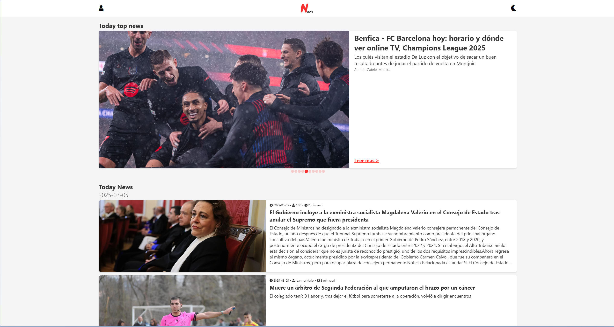
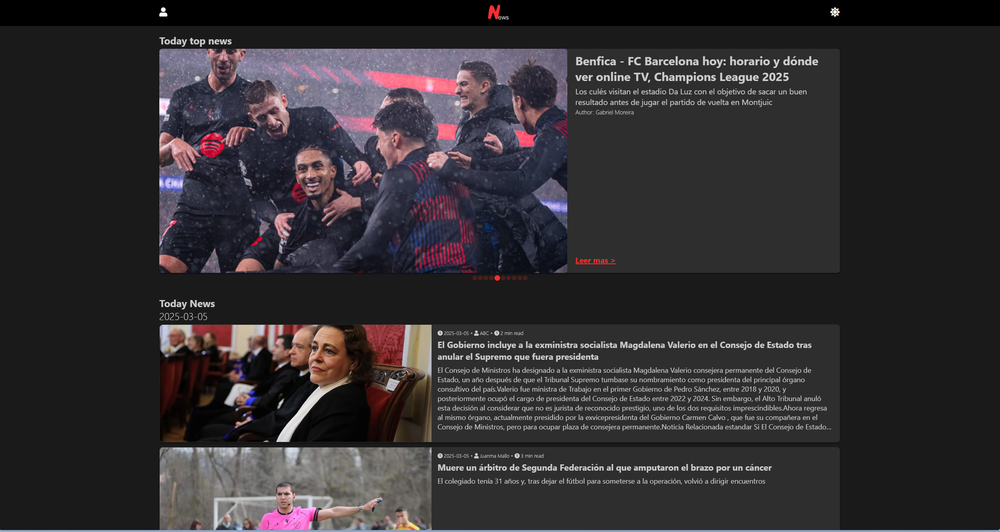
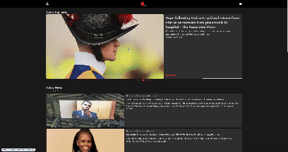

# Vanilla News Reader


Una aplicación en vanilla JavaScript que extrae noticias de diversas fuentes usando la API de [World News](https://worldnewsapi.com/) y las muestra en un solo lugar para una lectura fácil y cómoda.

<p align="center">
  
  
</p>

<p align="center">
  
  
</p>

## Iniciar el proyecto en local

Pasos para iniciar el proyecto en local:

1. Instala las dependencias del proyecto ejecutando el siguiente comando.

```bash
    npm install
```

2. Luego, ejecuta el comando para arrancar el servidor de desarrollo.

```bash
    npm run dev
```

Esto iniciará el proyecto en un servidor local este servidor ejecuta tanto el frontend como el backend.

## Cambios Recientes

Implementé animaciones usando la API de View Transitions.



Mira el video aquí: [Ver animación](./img/view-transitions.mp4)

> ⚠️ **Advertencia:** La API de View Transitions solo es compatible con algunos navegadores.  
> Consulta la [documentación oficial](https://developer.mozilla.org/en-US/docs/Web/API/View_Transitions_API) para más detalles.

## APIs Utilizadas

**Noticias**: Para obtener las noticias, utilicé la API de [World News](https://worldnewsapi.com/).
